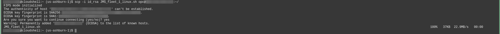
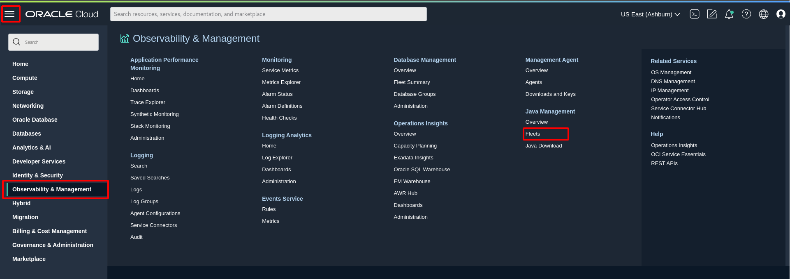
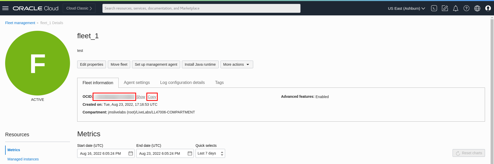

# Install Management Agent on your Managed Instances

## Introduction

This lab walks you through the steps to set up Java Management Service and Management Agent plugins on your OCI compute instance host using the Oracle Cloud Agent to allow Java Usage Tracking and Lifecycle Management by the Java Management Service (JMS) using Cloud Shell.

Estimated Time: 15 minutes

### Objectives

In this lab, you will:

- Install a Management Agent on a compute instance
- Verify Management Agent and Plug-ins
- Check that management agent is tagged with the Fleet OCID
- Monitor the Java Runtimes and Java applications in JMS

### Prerequisites

* You have signed up for an account with Oracle Cloud Infrastructure and have requested workshop reservation on LiveLabs.

## Task 1: Prepare installation script for Management Agent installation

1. Click the Cloud Shell icon in the Console header. This icon is accessible from mostly all the OCI Console pages.

  

  The Cloud Shell will open and may look something like this.
  

  You can use the icons in the upper right corner of the Cloud Shell window to minimize, maximize, and close your Cloud Shell session.
  

2. Prepare your SSH private key and the installation script for Linux downloaded in [Lab 1](?lab=setup-a-fleet). Click **Cloud Shell Menu** and **Upload**.
  

3. In the popup windows, select your file and click **Upload**. You should upload SSH private key and the installation script separately.
  

4. Check that both files have been uploaded.
  

5. In the Cloud Shell, enter the following command to change the read and write permissions to your SSH private key.

    ```
    <copy>
    chmod 400 <your-private-key-file>
    </copy>
    ```

6. In the Oracle Cloud Console, open the navigation menu, click **Compute**, and then click **Instances**. Select the instance **LLxxxxx-INSTANCE-JMS**. This instance should be in the same compartment in [Lab 1](?lab=setup-a-fleet).
  

7. Under **Instance information**, copy the public IP address.
  

8. In the Cloud Shell, enter the following command to transfer the installation script to the instance. Type **yes** and **Enter** to continue.

    ```
    <copy>
    scp -i <your-private-key-file> <your-installation-script-file> opc@<copied-ip-address>:~/
    </copy>
    ```

  The output may look like this:
  

## Task 2: Install Management Agent

1. In the Cloud Shell, enter the following command to connect to your instance using SSH. The IP address should be the one you copied in task 1.

    ```
    <copy>
    ssh -i <your-private-key-file> opc@<copied-ip-address>
    </copy>
    ```

2. Enter the following command to change file permissions.

     ```
     <copy>
     chmod +x JMS_<your-fleet-name>_Linux.sh
     </copy>
     ```

3. Enter the following command to run the installation script. The installation may around 10 minutes to complete.

     ```
     <copy>
     sudo ./JMS_<your-fleet-name>_Linux.sh
     </copy>
     ```


## Task 3: Verify Management Agent Installation

1. In the Oracle Cloud Console, open the navigation menu, click **Observability & Management**, and then click **Agents** under **Management Agent**.

  

2. From the Agents list, look for the agent that was recently installed. This agent should be in the compartment created in [Lab 1](?lab=set-up-oci-for-jms).

  

## Task 4: Verify Plug-in Deployment

**On non-OCI Linux Managed Instances:**

1. In your agent, click **Deploy plug-ins**. The **Java Usage Tracking** plug-in should be checked.

  

2. For **Java Management Service** plug-in, go to compute instance page.

  

3. Select your instance, click the **Oracle Cloud Agent** tab.

  

4. The status of **Oracle Java Management Service** plug-in should be **Running**.

  

## Task 5: Check that management agent is tagged with the Fleet OCID

1. In the Oracle Cloud Console, open the navigation menu, click **Observability & Management**, and then click **Fleets** under **Java Management**.

  

2. Select the Fleet created in [Lab 2](?lab=setup-a-fleet).

3. Take note of the fleet ocid.

  

4. In the Oracle Cloud Console, open the navigation menu and click **Observability & Management**, and then click **Agents**.
   

5. Select the compartment that the management agent is contained in.

  

6. Select the management agent to view more details

7. Under **Tags**, the `jms` tag will be indicated to show that the management agent is linked to that fleet. The fleet ocid under the jms tag should be the same fleet ocid noted in Step 3.

  

8. The management agent has been associated to your fleet in JMS. It will now collect information on your Java runtimes and Java Usage based on the scanning frequency defined in [Lab 2: Set Up a Fleet](?lab=setup-a-fleet).

## Task 6: Verify detection of Java applications and runtimes

Now that the Management Agent has been set up in your compute instance, it will be able to detect the Java applications that have been executed in the compute instance. This can be observed in the Oracle Cloud Console.

1. In the Oracle Cloud Console, open the navigation menu, click **Observability & Management**, and then click **Fleets** under **Java Management**.

  

2. Select the compartment that the fleet is in and click the fleet.

3. Click **Java Runtimes** under **Resources**. If tagging and installation of management agents is successful, Java Runtimes will be indicated on the Fleet Main Page after 5 minutes.

  You should see a list of Java Runtimes from Java 8 to Java 18, these Java Runtimes are pre-installed in the compute instance in Task 1.

  

4. Click **Applications** under **Resources**. You should now see four applications. The first three are examples of DropWizard, SpringBoot and Micronaut, these applications are pre-installed and running in the compute instance in Task 1. The fourth is the Oracle Java Management Service plugin.

  

  You may now **proceed to the next lab.**


## Learn More

- Refer to the [Management Agent Concepts](https://docs.oracle.com/en-us/iaas/management-agents/doc/you-begin.html) and [Installation of Management Agents](https://docs.oracle.com/en-us/iaas/management-agents/doc/install-management-agent-chapter.html) sections of the JMS documentation for more details.

- Use the [Troubleshooting](https://docs.oracle.com/en-us/iaas/jms/doc/troubleshooting.html#GUID-2D613C72-10F3-4905-A306-4F2673FB1CD3) chapter for explanations on how to diagnose and resolve common problems encountered when installing or using Java Management Service.

- If the problem still persists or if the problem you are facing is not listed, please refer to the [Getting Help and Contacting Support](https://docs.oracle.com/en-us/iaas/Content/GSG/Tasks/contactingsupport.htm) section or you may open a support service request using the **Help** menu in the Oracle Cloud Console.

## Acknowledgements

- **Author** - Yixin Wei, Java Management Service
- **Last Updated By** - Yixin Wei, August 2022